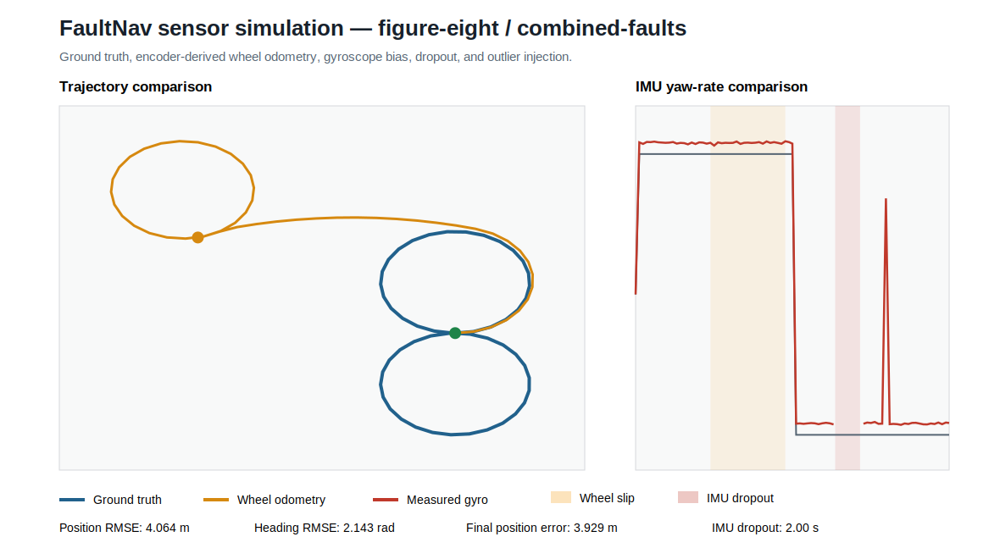

# FaultNav ROS 2

[](https://github.com/seneserisen/ros2-autonomous-mobile-robot/actions/workflows/python-core.yml)

A Python-first ROS 2 engineering project for mobile-robot kinematics, encoder and IMU simulation, fault injection, odometry, reproducible experiments, and the staged development of fault-aware autonomous navigation.

## Engineering evidence

FaultNav is organised as a growing autonomy system rather than a collection of tutorial scripts. The current `v0.3.0` milestone demonstrates:

- exact differential-drive/unicycle integration;
- typed and reproducible straight, circular, square, and figure-eight scenarios;
- wheel-encoder quantisation and encoder-derived odometry;
- seeded Gaussian encoder, gyroscope, and accelerometer noise;
- encoder scale error, asymmetric wheel slip, gyroscope bias, IMU dropout, and outliers;
- explicit separation of ground truth, measurements, and estimated wheel odometry;
- CSV datasets, JSON metrics, and dependency-free SVG engineering reports;
- ROS 2 `cmd_vel`, odometry, parameters, launch files, and TF broadcasting;
- stale-command protection, automated tests, linting, and multi-version CI.

These features provide visible evidence of Python software engineering, robotics modelling, sensor simulation, fault analysis, test design, and technical documentation.

## Sensor-fault experiment



The committed figure-eight experiments use a `0.1 s` integration step, a `2048` count/revolution encoder, an `0.08 m` wheel radius, an `0.34 m` wheel separation, and random seed `7`.

| Metric | Nominal seeded noise | Combined stress-test faults |
|---|---:|---:|
| Wheel-position RMSE | 0.00723 m | 4.06377 m |
| Wheel-heading RMSE | 0.00431 rad | 2.14287 rad |
| Final wheel-position error | 0.00239 m | 3.92943 m |
| Maximum absolute gyro error | 0.00975 rad/s | 0.84212 rad/s |
| Wheel-slip duration | 0 s | 6.0 s |
| IMU-dropout duration | 0 s | 2.0 s |
| Gyro-outlier duration | 0 s | 0.2 s |

Reproduced metrics:

- [`examples/figure_eight_nominal_sensor_metrics.json`](examples/figure_eight_nominal_sensor_metrics.json)
- [`examples/figure_eight_combined_faults_sensor_metrics.json`](examples/figure_eight_combined_faults_sensor_metrics.json)

The combined profile is intentionally severe. It applies left/right encoder scale errors of `+1%` and `-0.5%`, asymmetric wheel-rate distortion of `+25%` and `-5%` from `6–12 s`, a `0.04 rad/s` gyro bias, IMU dropout from `16–18 s`, and a `0.8 rad/s` yaw-rate outlier from `20.0–20.2 s`.

These are simulated measurements used to evaluate software behaviour. They are not hardware data or claims of physical localisation accuracy.

## Deterministic motion baseline


The analytical figure-eight baseline generated with a `0.2 s` integration step covers `12.5664 m` over `25.1327 s` and returns to its initial position with a floating-point closure error of approximately `1.812 × 10⁻¹⁴ m`.

That baseline validates numerical consistency before encoder resolution, measurement noise, and faults are introduced.

## Current capabilities

### Motion and experiment layer

- exact constant-twist integration;
- exact command-segment boundaries;
- built-in `straight`, `circle`, `square`, and `figure-eight` scenarios;
- path length, final pose, displacement, duration, sample count, and closure metrics;
- deterministic CSV, JSON, and SVG artifact generation.

### Sensor and fault layer

- differential-drive wheel-rate conversion;
- cumulative integer encoder counts;
- encoder-derived wheel odometry;
- IMU yaw rate and longitudinal acceleration;
- seeded noise through `numpy.random.Generator`;
- time-window fault activation;
- nominal, wheel-slip, gyro-bias, and combined-fault profiles;
- position RMSE, heading RMSE, final error, maximum error, and fault-duration metrics.

### ROS 2 layer

- `geometry_msgs/Twist` subscription on `cmd_vel`;
- `nav_msgs/Odometry` publication on `odom`;
- `odom` to `base_link` TF broadcasting;
- configurable update rate, frame names, TF output, and command timeout;
- zero-velocity fallback when the latest command becomes stale;
- `ament_python` packaging, YAML parameters, and launch support.

## Quick start without ROS 2

```bash
git clone https://github.com/seneserisen/ros2-autonomous-mobile-robot.git
cd ros2-autonomous-mobile-robot
python -m venv .venv
source .venv/bin/activate  # Windows: .venv\Scripts\activate
python -m pip install -e .
```

Run the ideal motion experiment:

```bash
faultnav-experiment \
  --scenario figure-eight \
  --step 0.2 \
  --output-dir artifacts/motion
```

Run the nominal sensor profile:

```bash
faultnav-experiment \
  --scenario figure-eight \
  --step 0.1 \
  --sensor-profile nominal \
  --seed 7 \
  --output-dir artifacts/nominal
```

Run the combined fault profile:

```bash
faultnav-experiment \
  --scenario figure-eight \
  --step 0.1 \
  --sensor-profile combined-faults \
  --seed 7 \
  --output-dir artifacts/combined-faults
```

Available sensor profiles:

```text
none
nominal
wheel-slip
gyro-bias
combined-faults
```

Sensor experiments generate:

```text
artifacts/combined-faults/
├── figure_eight_combined_faults_sensor.csv
├── figure_eight_combined_faults_sensor_metrics.json
└── figure_eight_combined_faults_sensor_report.svg
```

## Run as a ROS 2 package

Place the repository inside a ROS 2 workspace:

```bash
mkdir -p ~/faultnav_ws/src
cd ~/faultnav_ws/src
git clone https://github.com/seneserisen/ros2-autonomous-mobile-robot.git
cd ..
rosdep install --from-paths src --ignore-src -r -y
colcon build --symlink-install
source install/setup.bash
```

Launch the odometry node:

```bash
ros2 launch faultnav_robot faultnav.launch.py
```

Publish a velocity command:

```bash
ros2 topic pub --once /cmd_vel geometry_msgs/msg/Twist \
  "{linear: {x: 0.5}, angular: {z: 0.3}}"
```

Inspect odometry:

```bash
ros2 topic echo /odom
```

The default command timeout is `0.5 s`. When the command becomes stale, the published velocity returns to zero and pose integration stops.

## Architecture

```text
MotionScenario
      |
      v
Ground-truth kinematics ---------------------------> truth pose and twist
      |
      +--> ideal wheel rates
      |          |
      |          +--> scale error / slip / noise
      |          +--> quantised encoder counts
      |          +--> encoder-derived wheel odometry
      |
      +--> ideal yaw rate / acceleration
                 |
                 +--> bias / noise / dropout / outlier
                 +--> simulated IMU measurements

Artifacts: CSV dataset + JSON metrics + SVG report
ROS 2: cmd_vel -> odometry node -> nav_msgs/Odometry + TF
```

Ground truth is not overwritten by the corrupted measurement path. This prevents a faulty sensor model from silently changing the reference trajectory used to calculate error.

See [`docs/architecture.md`](docs/architecture.md) for module responsibilities, modelling assumptions, and frame ownership.

## Differential-drive model

For body velocity `v`, yaw rate `ω`, wheel radius `r`, and wheel separation `b`:

```text
ω_left  = [v - (b/2)ω] / r
ω_right = [v + (b/2)ω] / r
```

Encoder odometry reconstructs wheel distance from integer count increments:

```text
Δφ = 2π Δcount / counts_per_revolution
Δs_left  = r Δφ_left
Δs_right = r Δφ_right
Δs       = (Δs_left + Δs_right) / 2
Δθ       = (Δs_right - Δs_left) / b
```

The resulting body increment is integrated with the same analytical constant-twist solution used by the ground-truth model, but it receives only encoder-derived increments.

## Validation workflow

```bash
python -m pip install -e . -r dev-requirements.txt
ruff check src tests setup.py launch
pytest
```

Automated tests cover:

- straight, rotational, and constant-radius integration;
- angle wrapping and invalid input handling;
- scenario timing and deterministic closure;
- wheel-rate conversion and encoder reconstruction;
- zero-noise ideal measurements;
- repeated output with the same random seed;
- wheel-slip odometry degradation;
- gyro bias, dropout, and outlier reporting;
- CSV, JSON, SVG, and installed-CLI artifact generation.

GitHub Actions validates Python 3.10, 3.11, and 3.12, including both the motion and sensor-fault CLI workflows.

## Repository structure

```text
.
├── .github/workflows/python-core.yml
├── config/faultnav.yaml
├── docs/architecture.md
├── examples/
│   ├── figure_eight_trajectory.svg
│   ├── figure_eight_nominal_sensor_metrics.json
│   ├── figure_eight_combined_faults_sensor_metrics.json
│   └── figure_eight_combined_faults_sensor_report.svg
├── launch/faultnav.launch.py
├── src/faultnav_robot/
│   ├── differential_drive.py
│   ├── experiment_cli.py
│   ├── experiments.py
│   ├── odometry_node.py
│   ├── scenarios.py
│   ├── sensor_reports.py
│   └── sensors.py
├── tests/
├── package.xml
├── pyproject.toml
└── setup.py
```

## Roadmap

### Next — state estimation and fault monitoring

- Extended Kalman Filter for planar pose and velocity;
- covariance propagation;
- encoder and IMU measurement updates;
- innovation and Normalized Innovation Squared monitoring;
- measurement rejection and fault-detection metrics;
- raw odometry versus EKF versus fault-aware EKF comparison.

### Robot simulation

- URDF/Xacro differential-drive model;
- physics-simulator integration;
- laser scanner and IMU topics;
- RViz visualisation.

### Autonomous navigation

- SLAM Toolbox and localisation;
- Nav2 planner and controller configuration;
- navigation success rate, path length, completion time, and recovery metrics.

### Hardware-in-the-loop

- microcontroller wheel-speed control;
- quadrature encoder and IMU interfaces;
- micro-ROS communication;
- measured latency, tracking error, and physical fault experiments.

## Engineering limitations

- Current ROS odometry is still derived from commanded rather than measured wheel motion.
- Sensor models are controlled simulations and do not yet include actuator dynamics or identified hardware parameters.
- Wheel-slip distortion is a configurable measurement model rather than a tyre-ground physics model.
- Published ROS covariance entries remain placeholders.
- Full physics-simulator and physical-robot integration have not yet been validated.
- The project is educational portfolio software, not a safety-certified controller.

## Author

Sadik Enes Erisen — M.Sc. Autonomy Technologies, FAU Erlangen-Nürnberg; B.Sc. Electrical and Electronics Engineering.
