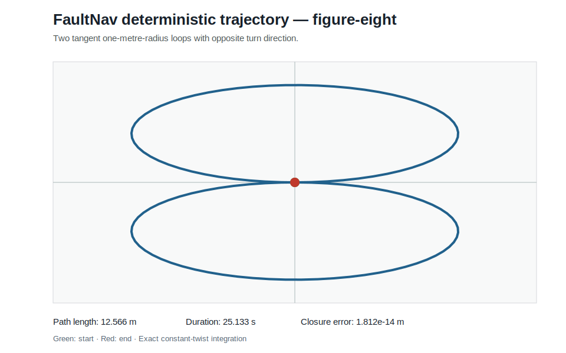

# FaultNav ROS 2

[](https://github.com/seneserisen/ros2-autonomous-mobile-robot/actions/workflows/python-core.yml)

A Python-first ROS 2 engineering project for deterministic mobile-robot motion, odometry, reproducible experiments, and the gradual development of fault-aware autonomous navigation.

## Engineering value

FaultNav is structured as a staged autonomy project rather than a single demonstration script. The current release shows:

- clean separation between mathematical models and ROS 2 interfaces;
- exact differential-drive motion integration;
- reproducible straight, circular, square, and figure-eight experiments;
- CSV data, JSON metrics, and SVG engineering reports;
- ROS 2 `cmd_vel`, odometry, parameters, launch files, and TF broadcasting;
- stale-command handling that stops motion when command input expires;
- typed Python modules, automated tests, linting, and multi-version CI.

These features provide visible evidence of Python software engineering, robotics fundamentals, numerical modelling, test design, and technical documentation.

## Reproduced trajectory



The committed figure-eight example was generated with a `0.2 s` integration step:

| Metric | Reproduced value |
|---|---:|
| Commanded duration | 25.1327 s |
| Travelled path | 12.5664 m |
| Samples including initial state | 127 |
| Final-position closure error | 1.812 × 10⁻¹⁴ m |

The complete output is stored in [`examples/figure_eight_metrics.json`](examples/figure_eight_metrics.json).

The closure result demonstrates deterministic numerical consistency under the documented analytical model. It is **not** a claim of physical localisation accuracy; real robots introduce encoder error, wheel slip, latency, dynamics, calibration error, and sensor noise.

## Current capabilities

### Deterministic experiment layer

- reusable command-segment and scenario dataclasses;
- exact handling of segment boundaries even when the fixed step does not divide the duration;
- built-in `straight`, `circle`, `square`, and `figure-eight` scenarios;
- path length, final pose, displacement, duration, sample count, and closure metrics;
- dependency-free SVG trajectory reporting;
- stable CSV and JSON artifact generation;
- command-line workflow through `faultnav-experiment`.

### ROS 2 layer

- `geometry_msgs/Twist` subscription on `cmd_vel`;
- `nav_msgs/Odometry` publication on `odom`;
- `odom` to `base_link` TF broadcasting;
- configurable update rate, frame names, TF output, and command timeout;
- zero-velocity fallback when the most recent command becomes stale;
- `ament_python` packaging, YAML parameters, and launch support.

## Quick experiment without ROS 2

```bash
git clone https://github.com/seneserisen/ros2-autonomous-mobile-robot.git
cd ros2-autonomous-mobile-robot
python -m venv .venv
source .venv/bin/activate  # Windows: .venv\Scripts\activate
python -m pip install -e .

faultnav-experiment \
  --scenario figure-eight \
  --step 0.2 \
  --output-dir artifacts/figure-eight
```

Generated artifacts:

```text
artifacts/figure-eight/
├── figure_eight_metrics.json
├── figure_eight_trajectory.csv
└── figure_eight_trajectory.svg
```

Available scenarios:

```bash
faultnav-experiment --scenario straight
faultnav-experiment --scenario circle
faultnav-experiment --scenario square
faultnav-experiment --scenario figure-eight
```

## Run as a ROS 2 package

Place the repository inside a ROS 2 workspace:

```bash
mkdir -p ~/faultnav_ws/src
cd ~/faultnav_ws/src
git clone https://github.com/seneserisen/ros2-autonomous-mobile-robot.git
cd ..
rosdep install --from-paths src --ignore-src -r -y
colcon build --symlink-install
source install/setup.bash
```

Launch the odometry node:

```bash
ros2 launch faultnav_robot faultnav.launch.py
```

Publish a velocity command:

```bash
ros2 topic pub --once /cmd_vel geometry_msgs/msg/Twist \
  "{linear: {x: 0.5}, angular: {z: 0.3}}"
```

Inspect odometry:

```bash
ros2 topic echo /odom
```

The default command timeout is `0.5 s`. When the command becomes stale, the published velocity returns to zero and pose integration stops.

## Architecture

```text
Built-in scenario / CLI                         ROS 2 command interface
          |                                               |
          v                                               v
CommandSegment sequence                         geometry_msgs/Twist
          |                                               |
          v                                               v
Exact constant-twist integration <------ shared kinematics core
          |                                               |
          +--> CSV trajectory                             +--> nav_msgs/Odometry
          +--> JSON metrics                               +--> TF odom -> base_link
          +--> SVG report                                 +--> command timeout stop
```

The mathematical core has no ROS imports. It can therefore be tested with standard Python tooling and reused later by sensor simulation, state estimation, physics simulation, or hardware-interface nodes.

See [`docs/architecture.md`](docs/architecture.md) for design decisions and frame ownership.

## Technical model

For straight motion:

```text
x_next     = x + v cos(theta) dt
y_next     = y + v sin(theta) dt
theta_next = wrap(theta + omega dt)
```

For non-zero yaw rate, FaultNav uses the analytical circular-arc solution:

```text
R          = v / omega
x_next     = x + R [sin(theta + omega dt) - sin(theta)]
y_next     = y - R [cos(theta + omega dt) - cos(theta)]
theta_next = wrap(theta + omega dt)
```

This avoids the accumulated approximation error of first-order Euler integration for constant curved motion.

## Validation and development workflow

```bash
python -m pip install -r dev-requirements.txt
ruff check src tests setup.py launch
pytest
```

The repository contains automated tests for:

- straight, rotational, and constant-radius integration;
- angle wrapping and invalid input handling;
- built-in scenario definitions;
- exact segment-duration handling;
- circular-path closure;
- deterministic repeatability;
- CSV, JSON, and SVG artifact generation.

GitHub Actions runs the Python validation matrix on Python 3.10, 3.11, and 3.12.

## Repository structure

```text
.
├── .github/workflows/python-core.yml
├── config/faultnav.yaml
├── docs/architecture.md
├── examples/
│   ├── figure_eight_metrics.json
│   └── figure_eight_trajectory.svg
├── launch/faultnav.launch.py
├── resource/faultnav_robot
├── src/faultnav_robot/
│   ├── differential_drive.py
│   ├── experiment_cli.py
│   ├── experiments.py
│   ├── odometry_node.py
│   └── scenarios.py
├── tests/
├── package.xml
├── pyproject.toml
├── setup.cfg
└── setup.py
```

## Roadmap

### Next — sensor simulation and fault injection

- wheel-encoder and IMU models;
- Gaussian noise, slowly varying bias, dropout, outliers, and wheel slip;
- deterministic fault scenarios and detection-delay metrics.

### State estimation

- Extended Kalman Filter;
- covariance propagation;
- innovation and Normalized Innovation Squared monitoring;
- measurement rejection and fault-detection evaluation.

### Robot simulation

- URDF/Xacro differential-drive model;
- physics-simulator integration;
- laser scanner and IMU topics;
- RViz visualisation.

### Autonomous navigation

- SLAM Toolbox and localisation;
- Nav2 planner and controller configuration;
- navigation success rate, path length, completion time, and recovery metrics.

## Engineering limitations

- Current ROS odometry is derived from commanded rather than measured wheel motion.
- Sensor uncertainty, wheel slip, latency, dynamics, and actuator saturation are not yet modelled.
- Published covariance entries are placeholders and are not identified from physical data.
- Full ROS 2 simulator and physical-robot integration have not yet been validated.
- The project is educational portfolio software, not a safety-certified controller.

## Author

Sadik Enes Erisen — M.Sc. Autonomy Technologies, FAU Erlangen-Nürnberg; B.Sc. Electrical and Electronics Engineering.
